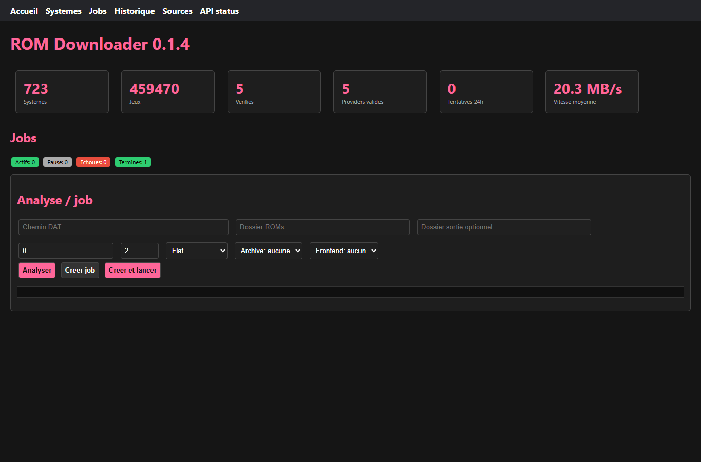
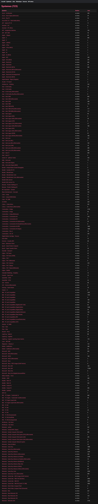
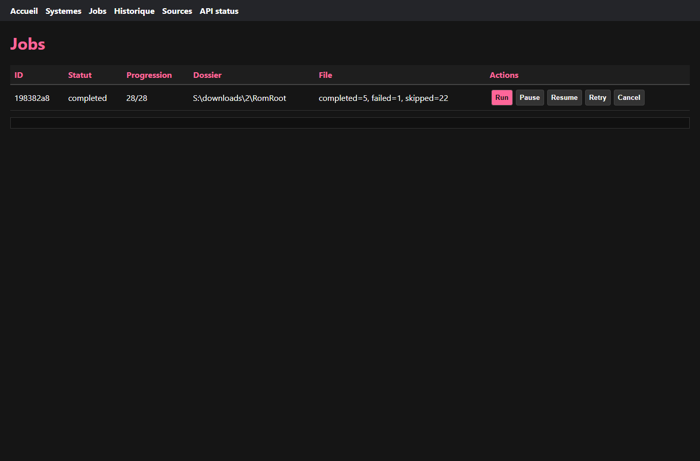
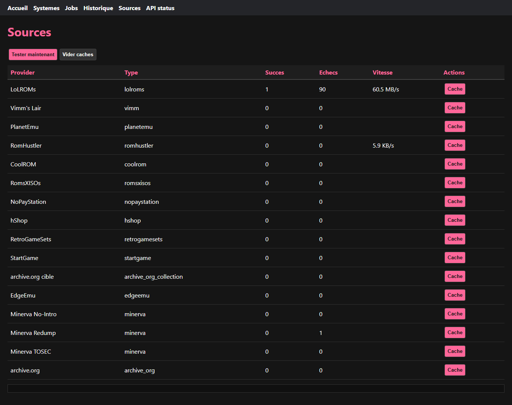
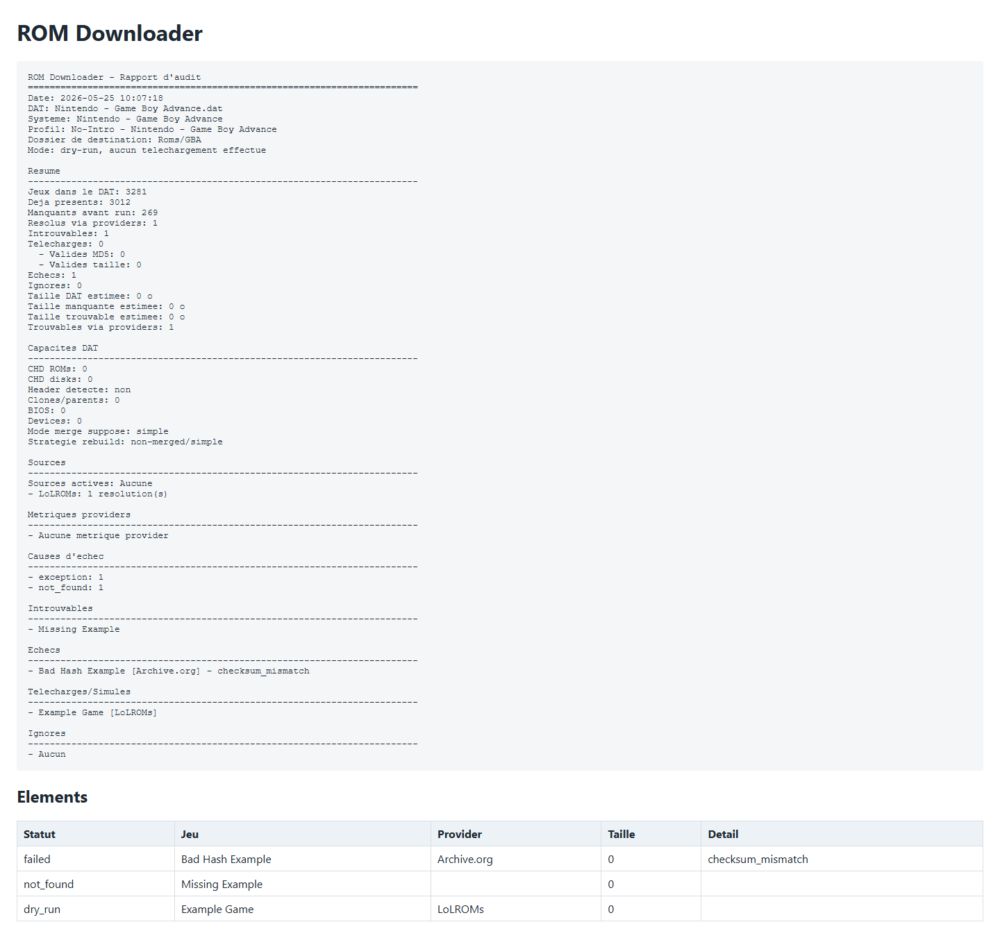

# ROM Downloader

**ROM Downloader - Complementeur et auditeur de collections ROMs base sur DAT No-Intro / Redump / Retool.**

Audit, complete et verifie une collection ROMs a partir de DAT No-Intro, Redump ou Retool, avec sources multiples, reprise de telechargement, validation hash/taille, rapports exportables (TXT/JSON/CSV/HTML), scoring provider par systeme et interface Windows portable.

Version developpement: `0.1.4` - Derniere release stable: [`v0.1.4`](https://github.com/Balrog57/rom_downloader/releases/tag/v0.1.4)

> **Avertissement**: ROM Downloader est un outil de gestion de collection. Il ne fournit ni n'heberge de fichiers ROMs. Voir [DISCLAIMER.md](DISCLAIMER.md).

## Premier lancement

### Exe portable

1. Telechargez `ROMDownloader.exe` depuis la derniere release GitHub.
2. Placez-le dans un dossier dedie, par exemple `D:\Apps\ROMDownloader`.
3. Lancez l'exe, ouvrez la page `Charger DAT`, choisissez un DAT, puis indiquez votre dossier ROMs dans `Telechargements`.
4. Cochez `Audit uniquement (dry-run, aucun fichier ROM ecrit)` pour commencer sans telechargement.
5. Cliquez sur `Scanner le dossier`, puis lancez l'audit ou le telechargement depuis la page `Jeux` ou `Telechargements`.

En mode exe portable:

- les ressources embarquees (`assets/`, `dat/`, `db/`, `VERSION`) sont lues depuis l'exe;
- les fichiers utilisateur sont crees a cote de `ROMDownloader.exe`: `.env`, preferences, caches, metriques provider;
- une reinstall ou un deplacement du dossier conserve donc la configuration si ces fichiers restent avec l'exe.

Installation rapide depuis PowerShell:

```powershell
powershell -ExecutionPolicy Bypass -Command "irm https://raw.githubusercontent.com/Balrog57/rom_downloader/main/install.ps1 | iex"
```

### Depuis Python

```powershell
python -m pip install -r requirements.txt
python main.py --gui
```

Sans argument, l'application lance aussi la GUI:

```powershell
python main.py
```

Un guide utilisateur plus direct est disponible dans [docs/USER_GUIDE.md](docs/USER_GUIDE.md).

## Captures d'ecran

Les captures suivantes sont generees depuis l'interface locale et un rapport HTML reel:







L'interface propose les pages suivantes:

- **Accueil**: tableau de bord avec statistiques (systemes indexes, jeux, jobs, sources bloquees)
- **Charger DAT**: import DAT No-Intro/Redump/Retool avec detection automatique du profil
- **Systemes**: navigation par catalogue (section, famille, lettre, recherche)
- **Jeux**: liste des jeux avec statut local, candidats provider, validation
- **Telechargements**: file persistante avec pause/reprise, erreurs, historique, options de parallele et audit dry-run
- **Historique**: tentatives de telechargement passees filtrables
- **Sources**: activation/desactivation, ordre, politiques (timeout, quota, delai), test de connexion, cache, metriques et statut Cloudflare

## Exemple reel : Nintendo - Game Boy Advance

### Audit avant telechargement

```powershell
python main.py "dat\no-intro\No-Intro\Nintendo - Game Boy Advance (20260517-075129).dat" "D:\Roms\GBA" --dry-run --report-formats txt,json,csv,html
```

Resultat attendu:

```text
ROM Downloader - Rapport d'audit
========================================================================
Systeme : Nintendo - Game Boy Advance
DAT : No-Intro 2026-05-20
Jeux attendus : 3281
Deja presents : 3012
Manquants : 269
Resolus via providers : 214
Introuvables : 55
Taille estimee : 1.8 Go
Mode : dry-run, aucun telechargement effectue
```

### Telechargement reel avec sortie RomVault/TorrentZip

```powershell
python main.py "dat\no-intro\No-Intro\Nintendo - Game Boy Advance (20260517-075129).dat" "D:\Roms\GBA" --clean-torrentzip
```

Pour les sets GBA LoLROMs, utilisez `--clean-torrentzip` si vous voulez des ZIP compatibles RomVault: LoLROMs fournit souvent des `.7z` contenant les ROMs attendues par les DAT.

## Utilisation CLI

```powershell
python main.py <fichier.dat> <dossier_roms> [options]
```

| Option | Description |
| --- | --- |
| `--analyze` | Analyse locale DAT/dossier puis quitte. Ne resout pas les providers par defaut. |
| `--analyze-candidates N` | Avec `--analyze`, resout les providers candidats pour N manquants. Utilisez `all` pour tout sonder. |
| `--dry-run` | Simule la resolution et le telechargement sans ecrire de ROM finale. Produit un rapport d'audit. |
| `--config-profile debutant-sur\|rapide\|archive-propre` | Applique un profil de configuration CLI. Les options explicites gardent la priorite. |
| `--report-formats txt,json,csv,html` | Exporte les rapports dans les formats demandes. Defaut: `txt`. |
| `--report-dir <dossier>` | Ecrit les rapports dans un dossier dedie au lieu du dossier de sortie. |
| `--limit N` | Limite le nombre de jeux traites. |
| `--parallel N` | Nombre de telechargements simultanes. |
| `--tosort` | Deplace les fichiers hors DAT vers `ToSort`. |
| `--clean-torrentzip` | Recompresse les archives validees en ZIP TorrentZip/RomVault. |
| `--output-mode flat\|verified\|tosort\|dat-structure` | Organise les fichiers valides en sortie selon le workflow choisi. |
| `--archive-mode none\|zip\|torrentzip` | Repacke les fichiers bruts en ZIP ou TorrentZip. Prioritaire sur `--clean-torrentzip`. |
| `--rebuild-tosort` | Reconstruit une sortie propre depuis `ToSort` par hash/taille DAT, puis quitte. |
| `--dat-capabilities` | Affiche les capacites DAT detectees: CHD, headers, clones, merge, BIOS/devices. |
| `--frontend batocera\|retrobat\|es-de\|launchbox` | Place les sorties dans les dossiers attendus par le frontend. |
| `--output-root-by-dat` | Cree un sous-dossier nomme comme le DAT sous le dossier indique. |
| `--prefer-1fichier` | Priorise RetroGameSets/StartGame avant les DDL directs. |

Commandes utiles:

```powershell
python main.py --version
python main.py --sources
python main.py --diagnose
python main.py --healthcheck-sources
python main.py --source-health
python main.py --provider-registry
python main.py --db-status
python main.py --queue-status
python main.py --queue-details <JOB_ID>
python main.py --retry-job <JOB_ID> --retry-retryable-only
python main.py --retry-job <JOB_ID> --retry-error-code http_429
python main.py --cleanup-job-parts <JOB_ID>
python main.py --mapping-status
python main.py --web
python main.py --clear-listing-cache
python main.py --clear-cache-source LoLROMs
```

## Rapports et audit

Le rapport final est ecrit sous la forme:

```text
rom_downloader_report_<systeme>_<timestamp>.txt
```

Avec `--report-formats`, les variantes `.json`, `.csv` et `.html` sont aussi produites. Le JSON contient des blocs stables `metadata`, `counts`, `sizes`, `sources` (incluant `top_sources` et `source_health`) et `items`. Le CSV contient une ligne par jeu avec statut, provider, fichier, taille et detail d'erreur. Le HTML est autonome et ne depend d'aucune ressource externe.

En `--dry-run`, le rapport indique explicitement:

```text
Mode: dry-run, aucun telechargement effectue
```

Il resume notamment:

- jeux dans le DAT;
- jeux deja presents;
- jeux manquants;
- jeux resolus via providers;
- jeux introuvables;
- taille DAT estimee;
- taille manquante estimee;
- taille trouvable estimee quand elle est disponible.
- **validation MD5** vs **validation taille seulement** (telechargement effectif);

Et dans la section "Sources les plus efficaces":

```text
Sources les plus efficaces
------------------------------------------------------------------------
1. LoLROMs: 124 succes(s), taux=78%
2. Archive.org: 52 succes(s), taux=91%
3. PlanetEmu: 18 succes(s), taux=67%
```

La GUI ecrit desormais les rapports aux formats TXT, JSON, CSV et HTML simultanement.

## Web UI locale

L'interface web locale se lance avec:

```powershell
python main.py --web
```

Par defaut, elle ecoute sur `http://127.0.0.1:8888`. Pour choisir une autre adresse:

```powershell
python main.py --web 127.0.0.1:8890
```

Elle expose les pages `Accueil`, `Systemes`, `Jobs`, `Historique` et `Sources`, ainsi que des endpoints JSON sous `/api/*` pour les integrations locales.

## Sources et fiabilite

Le pipeline essaie les providers dans cet ordre logique:

1. base locale shardee par checksum;
2. sources DDL directes: PlanetEmu, RomHustler, CoolROM, RomsXISOs, NoPayStation, hShop, Vimm's Lair, LoLROMs, RetroGameSets, StartGame;
3. collections archive.org ciblees par systeme, dont des groupes issus de RomGoGetter pour PS1/PS2/PS3/Xbox/Xbox 360/NDS/3DS/Wii U/PSP;
4. Minerva par torrent;
5. archive.org general en dernier recours.

La fiabilite repose sur:

- fichiers `.part` et reprise HTTP quand le serveur accepte `Range`;
- redemarrage propre si un serveur refuse la reprise ou retourne HTTP 416;
- detection des pages HTML/Cloudflare pour eviter de sauvegarder une page de challenge comme ROM;
- validation finale MD5, puis taille DAT si aucun MD5 n'est disponible;
- cache SQLite des candidats providers avec TTL et diagnostics HTTP/HTML/hash KO visibles via `--source-health`, rapports et Web UI;
- score provider explicable dans `--source-health`, Web UI et rapports: taux succes/echec, Cloudflare, HTML parasite, hash KO et vitesse connue;
- fallback provider apres erreur reseau, timeout, quota, rate-limit ou validation KO;
- circuit-breaker par source pendant la session, **persiste en SQLite** entre les sessions (les sources bloquees le restent au redemarrage);
- metriques provider persistantes en SQLite **par systeme** (`provider_system_metrics`) pour reordonner les sources les plus fiables par console.

Les politiques par source se reglent dans la GUI: activation, ordre, timeout, quota par run et delai avant telechargement. LoLROMs utilise par defaut un delai pour limiter les blocages Cloudflare.

## DAT, Retool et 1G1R

ROM Downloader ne choisit pas encore lui-meme les variantes 1G1R. Pour obtenir un set 1G1R, utilisez un DAT Retool deja filtre, par exemple un DAT `Retool - French No Unl`.

No-Intro est adapte aux cartouches et contenus numeriques, Redump aux supports disque, et Retool genere des DAT filtres a partir de ces bases selon des regles de region, langue et exclusion.

## Configuration

Copiez `.env.example` vers `.env`.

Variables courantes:

- `ONE_FICHIER_API_KEY`
- `ALLDEBRID_API_KEY`
- `REALDEBRID_API_KEY`
- `ARCHIVE_ORG_USERNAME`
- `ARCHIVE_ORG_PASSWORD`
- `LIBTORRENT_DLL_DIR` si vous utilisez le backend Python libtorrent avec DLL OpenSSL 1.1.

`aria2c` est le backend torrent Minerva prioritaire quand il est present dans le `PATH` ou installe via Winget/Chocolatey. Si `aria2c` et `libtorrent` sont absents, seules les sources HTTP/DDL restent disponibles.

## Profils de configuration

La GUI et la CLI (`--config-profile`) proposent des profils qui reglent plusieurs options d'un coup:

| Profil | Parallele | Audit | TorrentZip | ToSort | Usage |
|---|---|---|---|---|---|
| **Debutant sur** | 2 | Oui | Non | Non | Decouverte securisee, rien n'est ecrit |
| **Rapide** | 6 | Non | Non | Non | Maximum de vitesse, verification minimale |
| **Archive propre** | 2 | Non | Oui | Oui | Collection triee et validee pour RomVault |

ROM Downloader ne fournit pas de profil 1G1R interne: utilisez directement un DAT Retool/1G1R deja filtre.

## Limites connues

- **Sources web instables**: les providers dependent de sites web tiers qui peuvent etre indisponibles, ralentis, modifies ou bloques par Cloudflare.
- **Scraping fragile**: les extracteurs de pages peuvent casser si le HTML source change.
- **Couverture provider inegale**: LoLROMs couvre ~312 systemes, mais la plupart des autres sources en couvrent moins de 50.
- **Pas de gestion 1G1R integree**: utilisez un DAT Retool/1G1R deja filtre pour definir exactement le set attendu.
- **CHD pragmatique**: les CHD sont detectes et valides par hash/taille quand le DAT le permet, sans conversion ni rebuild arcade split/merged complet.
- **Windows uniquement**: l'EXE portable est concu pour Windows. Le code source Python peut fonctionner sur Linux/macOS mais sans garantie.

## Roadmap

La roadmap publique est maintenue dans [docs/ROADMAP.md](docs/ROADMAP.md). Elle liste les priorites court/moyen/long terme et les choix hors scope, notamment l'absence de provider Myrient HTTP et de selection 1G1R interne.

## FAQ erreurs courantes

**Cloudflare / page HTML sauvegardee**  
Le telechargeur detecte les reponses HTML suspectes et les classe en erreur reseau au lieu de les garder comme ROM. Reduisez `--parallel` a 1, augmentez le delai LoLROMs dans la GUI, ou desactivez temporairement la source.

**archive.org demande un compte**  
Renseignez `ARCHIVE_ORG_USERNAME` et `ARCHIVE_ORG_PASSWORD` dans `.env` pour les collections qui exigent une session.

**aria2c absent**  
Les torrents Minerva utilisent `aria2c` en priorite. Installez-le via Winget/Chocolatey ou laissez ROM Downloader utiliser seulement les sources HTTP disponibles.

**Hash KO / MD5 invalide**  
Le fichier est supprime ou ignore selon le flux de verification, le provider est penalise, et le rapport indique l'erreur. Relancez avec un autre provider ou inspectez le DAT.

**Archives `.7z` au lieu de `.zip`**  
Certaines sources fournissent des `.7z`. Activez `--clean-torrentzip` pour repacker les ROMs validees en ZIP TorrentZip compatibles RomVault.

## Structure

- `main.py`: point d'entree.
- `VERSION`: version SemVer utilisee par CLI, GUI et releases.
- `ROMDownloader.spec`: configuration PyInstaller officielle.
- `src/core/`: pipeline applicatif, GUI, DAT, scrapers, verification, torrentzip.
- `src/network/`: sessions, caches, circuit-breaker, metriques, pools.
- `src/providers/`: interface provider commune.
- `assets/`: icones/images GUI.
- `dat/`: DAT proposes dans le menu GUI.
- `.rom_downloader.sqlite`: base locale SQLite ignoree par Git, generee par `--index-catalog`.
- `.github/workflows/`: CI, packaging Windows, release Windows.

## Verification locale

```powershell
$files = @("main.py") + (Get-ChildItem src,tests -Recurse -Filter *.py | ForEach-Object { $_.FullName })
python -m py_compile @files
python tests\smoke_checks.py
python tests\core_helper_checks.py
python tests\download_single_checks.py
python tests\dat_coverage_checks.py
python tests\output_checks.py
python tests\web_ui_checks.py
python main.py --version
python main.py --sources
python main.py --diagnose
```

Build exe portable:

```powershell
pyinstaller --noconfirm --clean ROMDownloader.spec
dist\ROMDownloader.exe --version
dist\ROMDownloader.exe --sources
dist\ROMDownloader.exe --diagnose
```

Dans le diagnostic de l'exe, `Racine app` doit pointer vers le dossier contenant `ROMDownloader.exe`, pas vers un dossier temporaire `_MEI...`.

## Release mainteneur

```powershell
.\release.ps1 -Version 0.1.5 -Push
```

Le workflow `Release Windows` construit `ROMDownloader.exe`, genere `ROMDownloader.exe.sha256`, valide l'exe portable et attache les assets a la release GitHub quand le tag `v*` est pousse.
